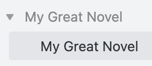
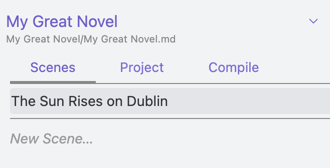
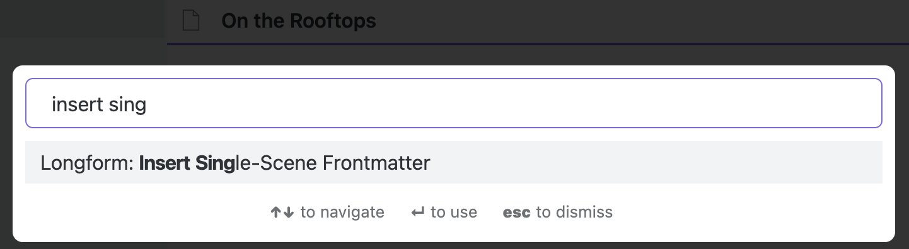

TODO:

- [ ] word counts?
- [ ] new draft button + modal

**WARNING**: This branch of Longform is in beta. It may not be stable. While the docs in `docs/` are up-to-date, this README is not. Please use it with caution.

## Longform

Longform is a plugin for [Obsidian](https://obsidian.md) that helps you write and edit novels, screenplays, and other long projects. It lets you organize a series of notes, or _scenes_, into an ordered manuscript. It also supports single-note projects for shorter works.

## Installing

Longform is in the Community Plugins section of Obsidian’s settings. You may also install it manually by copying the `main.js`, `manifest.json`, and `styles.css` files from a release into a `longform/` folder in the `.obsidian/plugins` folder of your vault. The Community Plugins interface is preferred.

## Getting Started

Longform works by searching your vault for any note that contains a frontmatter entry named `longform` (don’t worry if you don’t know what that means; Longform includes tools to help you generate these files). You can think of these notes as the “spines” or tables of contents of your projects. Let‘s walk through creating two different Longform projects: a novel and a short story.

### Creating a Novel

1. To begin a novel (or any other multi-scene project), let’s first create a note somewhere in our vault. We’ll create a folder called `My Great Novel` and then put a note inside of it called `My Great Novel`. Like this:



> **Note**
> You don’t have to use this folder or naming structure. Longform tries to be as flexible as possible, and provides options for customizing names and note locations. For the purposes of this walkthrough, though, we’re going to use this structure.

2. Next, we’ll insert the frontmatter we need to make sure Longform recognizes this new note as the basis of our novel. To do this we’ll use the **Longform: Insert Multi-Scene Frontmatter** command. Select it from the command palette. The top of your note should now look like this:

```yaml
---
longform:
  format: scenes
  folder: /
  scenes: []
  ignoredFiles: []
---
```

You can ignore that frontmatter for now. The tldr is that Longform uses the frontmatter in this [index note](./docs/INDEX_FILE.md) to keep track of what’s in your project.

3. Let’s select the project in Longform. Open the Longform pane in the left sidebar (the icon looks like a book), and in the dropdown at the top, select “My Great Novel“ if it’s not already selected. You’re presented with three tabs: Scenes, Project, and Compile.

4. At the bottom of the Scenes tab is a text field labeled “New Scene…”—click it and enter something that sounds like the first scene of a novel, maybe “The Sun Rises on Dublin,” and press enter. You should now be editing a so-named note, and your scene should appear in the Scenes tab:



Your editor also now has the scene open and ready to write. If you click the small `My Great Novel/My Great Novel.md` link under your project name, you’ll be taken back to the index file where you’ll see your new scene listed under the `scenes` frontmatter entry:

```yaml
  scenes:
    - The Sun Rises on Dublin
```

This is how Longform tracks your work.

> **Warning**
> You should probably avoid editing the `longform` frontmatter in your index file directly unless you really know what you’re doing. Longform supports direct editing of it and will do its best to sync, but it’s easy to accidentally mess things up. You can always revert your changes, though: Longform will never delete files based on changes in the index file.

5. You’re now ready to write your novel. Keep adding scenes as needed. If you’d like to add structure to your novel you can drag scenes left or right (or use the indent/Unindent commands) to create folders of scenes with parent scenes. [The full documentation for multiple-scene projects](./docs/MULTIPLE_SCENE_PROJECTS.md) might be useful.

6. When you’re ready to generate a single manuscript for your readers, use the [Compile](./docs/COMPILE.md) feature.

### Creating a Short Story

Longform also supports [single-scene projects](./docs/SINGLE_SCENE_PROJECTS.md) that live as a single note in your vault. Let’s create one.

1. First, create the note that will contain the story somewhere in your vault. Perhaps it’s a gritty little noir: we’ll call it `On the Rooftops`.

2. Next, use the **Longform: Insert Single-Scene Frontmatter** command to insert the necessary frontmatter required to have Longform recognize this file as a project.



Single-scene frontmatter is pretty simple:

```yaml
---
longform:
  format: single
---
```

3. Open the Longform pane. Your story should already be selected. Note that there is no Scenes tab as in multi-scene projects; in this case, the index file is your project.

4. Write your story! When you’re ready, you can use the Compile tab to generate a manuscript. Single-scene projects can use scene and manuscript steps in any order, and automatically have frontmatter removed at compile-time.

## Drafts & Projects

Longform supports the creation of multiple _drafts_ for a given project. Under the hood, drafts are just different Longform projects with the same title—they are then grouped together by Longform and presented as different versions of the same project.

To create a new draft of a project use the _New Draft_ button in the Project tab, or create an entirely new project somewhere and set the title in the Project tab to be the same as your existing project.

You can rename drafts by right-clicking them in the Project tab and selecting Rename, or by setting the `draftTitle` attribute in their `longform` frontmatter.

## Compiling

The Compile tab allows you to create custom workflows that turn your project into a manuscript. See [COMPILE.md](https://github.com/kevboh/longform/blob/main/docs/COMPILE.md) for more.

**Heads up**: Due to [this issue in the Templater plugin](https://github.com/SilentVoid13/Templater/issues/315), if you have Templater installed and its `Trigger Templater on new file creation` setting enabled, compiling very large drafts (~200k words) can occasionally cause Obsidian to freeze. Disable that setting before compiling if you have Templater installed.

### Scene-only Styling

Longform will automatically attach a `.longform-leaf` class to the container panes of any notes that are part of a Longform project. This means you can add custom CSS snippets to Obsidian that style your writing environment and _only_ your writing environment. For example, I prefer a dark theme for Obsidian but a light theme for writing, so my writing snippet looks something like this:

```css
.longform-leaf {
  --background-primary: white;
  --background-primary-alt: white;
  --background-secondary: white;
  --background-secondary-alt: white;
}

.longform-leaf .markdown-source-view {
  --background-primary: white;
  --background-primary-alt: white;
  --background-secondary: white;
  --background-secondary-alt: white;
  --text-selection: #aaa;
  --text-normal: black;
  color: black;
  background-color: white;
}

.longform-leaf .suggestion-item.is-selected {
  background-color: var(--text-accent);
}

.longform-leaf .view-header {
  background-color: white;
}

.longform-leaf .view-header-title {
  --text-normal: black;
}
```

Longform’s own UI will always use existing Obsidian CSS theme variables when possible, so it should always look at home in your theme.

## Troubleshooting

First, the most important bit: **Longform is built specifically to never alter the contents on your notes.** The only note it rewrites is a project’s index file. As such, Longform can’t delete or lose your notes.

Longform does a lot of complex tracking to bridge a project’s metadata with the state of files on disk. Although it tries to cover lots of edge cases, it is possible to cause desync between what Longform thinks is happening with projects and what’s actually going on. Most often this occurs when a project’s frontmatter is malformed or invalid in some way. Because projects are inferred from frontmatter, if your frontmatter is correct you can always restart Obsidian (or choose the "reload without saving" command) to force Longform to recalculate projects.

## Sponsorship

Any [sponsorship](https://github.com/sponsors/kevboh) is deeply appreciated, although by no means necessary.

## License

See [LICENSE.md](./LICENSE.md). You can view the license’s history [here](https://git.sr.ht/~boringcactus/fafol/tree/master/LICENSE.md).
