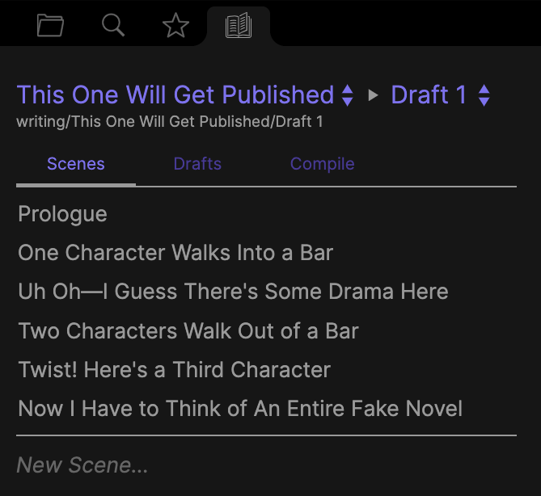
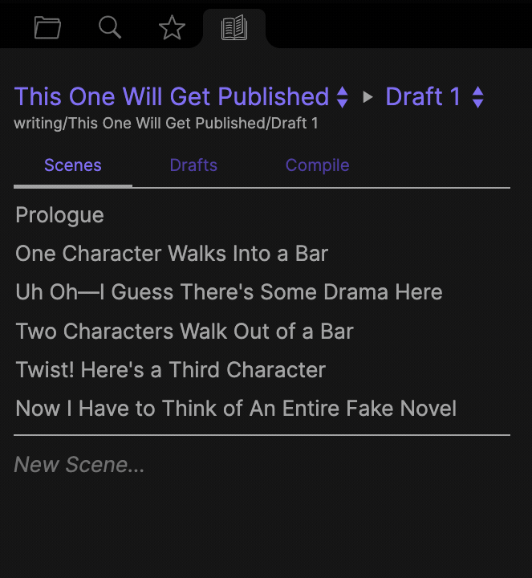

## Longform

Longform is a plugin for [Obsidian](https://obsidian.md) that helps you write and edit novels, screenplays, and other long projects.

To get started, right-click any folder you’d like to write a Longform project in and select “Mark as Longform Project.” You can always remove folders from Longform by right-clicking them and selecting “Unmark as Longform Project.” Unmarking a project does not delete anything: it just stops the plugin from tracking that folder and showing it in any UI.

Once you’ve marked a folder as a Longform project, you can switch to the Longform pane and add scenes (notes in a draft folder) to start writing.

Currently, Longform includes:

### The Project Explorer

An alternative file explorer pane that lists only your Longform projects.



All of your projects are available via dropdown. Every project is separated into multiple drafts. Drafts just folders of notes—here called _scenes_. Scenes are reorderable in the project explorer:



You can also quickly add new scenes by filling out the _New Scene_ field at the bottom of the explorer.

The **Scenes** tab is where you’ll do most of your composition. There’s also a **Drafts** tab that lets you reorder and rename your drafts. One more tab, **Compile**, is detailed below.

### Compiling

Right now, the Compile tab is a simplified version of the long-term vision for this feature. It currently is capable of generating a single `.md` file that consists of all the scenes in a given draft, in order, separated by newlines. A single checkbox option allows you to insert note titles as H1s (`#`) before each scene.

The plan is to dramatically expand what compilation can do down the road. Ideally, I’d like to get it to a place where you can define flexible [compilation workflows made up of multiple steps](https://github.com/kevboh/longform/issues/2). This way you could go from a Longform draft to a PDF manuscript, Word doc, or website. You may even be able to share workflows with others. This is a complicated feature, however, which requires a lot of thinking up-front about how best to build it. It’s also not something I’ll immediately need, and as such (and accordingly to this plugin’s philosophy, below) I won’t immediately build it. I will, however, try my best to help the community do what they’d like to do with their projects: after all, the entire point of this plugin is to no longer be locked into closed composition systems.

If you have suggestions or ideas for how you’d like this feature to work, please comment on the issue linked above noting so.

**Heads up**: Due to [this issue in the Templater plugin](https://github.com/SilentVoid13/Templater/issues/315), if you have Templater installed and its `Trigger Templater on new file creation` setting enabled, compiling very large drafts (~200k words) can occasionally cause Obsidian to freeze. Disable that setting before compiling if you have Templater installed.

### Scene-only Styling

Longform will automatically attach a `.longform-leaf` class to the container panes of any notes that are part of a Longform project. This means you can add custom CSS snippets to Obsidian that style your writing environment and _only_ your writing environment. For example, I prefer a dark theme for Obsidian but a light theme for writing, so my writing snippet looks something like this:

```css
.longform-leaf {
  --background-primary: white;
  --background-primary-alt: white;
  --background-secondary: white;
  --background-secondary-alt: white;
  --text-selection: #aaa;
  --text-normal: black;
  color: black;
}

.longform-leaf .suggestion-item.is-selected {
  background-color: var(--text-accent);
}

.longform-leaf .view-header {
  background-color: white;
}
```

Longform’s own UI will always use existing Obsidian CSS theme variables when possible, so it should always look at home in your theme.

## Future Features

Additionally, a few other features are planned or being considered:

- [ ] Support for per-scene scratch notes, for quickly jotting down ideas about your scene or saving off text for later.
- [ ] A research folder that both lists folder contents and can include notes that match certain search, link, or tag requirements. (This one I go back and forth one pretty much daily.)
- [ ] Per-draft and daily/goal word counts, if [this feature request](https://github.com/lukeleppan/better-word-count/issues/22) on the Better Word Count plugin is rejected.

I plan to mostly develop this plugin as I write my second novel. See below for the philosophy behind how this will work and why. While I’ll endeavor to make Longform generic enough to support other workflows, it will always be focused on solving the problems I’ve run into while writing novels.

## The Index File

Everything in Longform works based on a file created whenever you add a project called the _index file_. By default this file is called `Index.md` and lives in the root of a project; you can customize this when marking a folder for Longform.

The index file is a special file used by Longform to store metadata about your projects. The use a file in your vault instead of something like a plugin’s settings store is deliberate: a core philosophy of Longform is that if the plugin were to disappear tomorrow, no information vital to the structure of your project is lost. In other words, form is function.

The index file’s frontmatter is a, well, _index_ of your project’s contents. It’s technically editable, but doing so may have unintended effects, especially if you update the index such that it no longer matches the contents of folders in your vault.

Longform will automatically keep your index file in sync with your vault, updating it whenever you make a change to your project. This means the file is frequentally overwritten; **do not manually store meaningful information in this file**.

## Philosophy

I wrote my first novel in a mix of Scrivener and InDesign. Reading that, your first reaction is probably: _why?_ The answer is that as I worked through successive drafts of the novel I ran into three core problems with those programs. Combining the two as I did only partly solved my problems, which were:

1. The popular longform writing tools out there are great at letting you get words down, reorder scenes, and plan your work, but they tend to assume you’re writing straightforward paragraphs of text. If you want to experiment with unusual forms you’re out of luck. They’re wysiwyg, meaning you’re locked into a custom format, but lack precise styling. Or they’re markdown, which gets silly (see point 3).
2. If you want to experiment with unusual forms _so badly_ that you pay for and draft in something like InDesign, a typesetting program built for turning complete manuscripts into printable books, the actual writing and rewriting becomes incredibly difficult. InDesign just isn’t built for composition, it’s bulky, and it’s so arcane as to be unusable for most people.
3. In either program (or in both together!), your research probably lives outside the software. Scrivener has folders and features for collecting research documents, but it’s not a note-taking app, and it’s definitely not a knowledge base like Obsidian.

I’m going to break each of these problems down a little more, but I think it’s worth saying that by the time I deemed my first novel complete (or, you know, close enough, sigh) I was maintaining two separate manuscripts, one in Scrivener and one in InDesign, copying edits between the two. Integrating line edits from readers meant scanning page-by-page through 300+ page binders, making every edit twice. This was clearly untenable in retrospect, but I felt as if I had no other way.

However…there were other ways. I had backed myself into that setup because I’d started and wrote most of my book in Scrivener. But the problem I’m describing here is fairly well-known: when your text requires particular styling it means **the form is itself part of the text**. This means that form should be encoded alongside your text, as a single document that is your source of truth. There are lots of file formats that can do this, but in my case I’m most interested in LaTeX.

Let’s revisit the problems above, assuming we’re writing in Obsidian with this plugin, including perhaps some features that don’t yet exist—because again, I’m building this as I go.

### 1. Drafting with Form

Instead of using a WYSIWYG, we can use a combination of Markdown, LaTeX, and any other format we’re interested in to draft. Ideally either this plugin or a more format-specific one can provide previews as we write. If a format isn’t supported within Obsidian, we can just write the formatting anyway, then run our files through scripts outside of the app to generate a final product. The files we create while writing in this way are the only ones that describe our project.

### 2. Ease of Writing and Rewriting

Obsidian already has lots of affordances for writing freely. Its plugin architecture gives me confidence that that’s not going away: if you need a specific feature you can either find a plugin that exists for it or write one yourself (or find someone else in the community who’s similarly interested and knows how to write plugins.) And if Obsidian were to disappear, you still have a bunch of readable files you can import elsewhere or write to directly.

### 3. Linking Research

When working in Scrivener I always struggled to link research notes to my scenes. I was using either Simplenote or Ulysses at the time (it took me a long, long time to write a novel!), and I ended up duplicating relevant notes in a scene’s scratch inspector area. It wasn’t ideal and it fell apart when research changed. Looking back, there are lots of references in my book that I now either can’t recall or would have to chase down. In Obsidian, you can just…link to the note. Or put a comment next to the text. Maybe linking here requires special formatting to not render the link on preview—I’ll figure that out when I get to it—but I can now make obscure literary references in peace, knowing that I have the citation tucked away elsewhere in a note.

So that’s the idea. Treat your text and form as a unitary expression of the art, keep it all in one place, and lean on Obsidian to interlink the text with its research. I may throw this all away in a year; time will tell.

## Installing

Longform [will soon be available](https://github.com/obsidianmd/obsidian-releases/pull/400) in the Community Plugins section of Obsidian. You may also install it manually by copying the `main.js`, `manifest.json`, and `styles.css` files from a release into a `longform/` folder in the `.obsidian/plugins` folder of your vault. The Community Plugins interface is preferred.

## Troubleshooting

First, the most important bit: **Longform is built specifically to never alter the contents on your notes.** The only note it rewrites is a project’s index file. As such, Longform can’t delete or lose your notes.

Longform does a lot of complex tracking to bridge a project’s metadata with the state of files on disk. Although it tries to cover lots of edge cases, it is possible to cause desync between what Longform thinks is happening with projects and what’s actually going on. This tends to look like projects unavailable in the picker dropdown, or no scenes appearing in the scene list despite the notes definitely being there in the folder. If this happens to you, there’s a big red button in the plugin settings called `Untrack All Projects`. Clicking this will wipe Longform’s local understanding of what are and aren’t projects. After using that button, you can manually re-mark projects as Longform ones by right-clicking the folder in the file explorer. This should hopefully re-sync everything. If that doesn’t work, please file an issue!

## Sponsorship

Any [sponsorship](https://github.com/sponsors/kevboh) is deeply appreciated, although by no means necessary.

## License

See [LICENSE.md](./LICENSE.md). You can view the license’s history [here](https://git.sr.ht/~boringcactus/fafol/tree/master/LICENSE.md).
