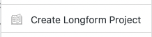
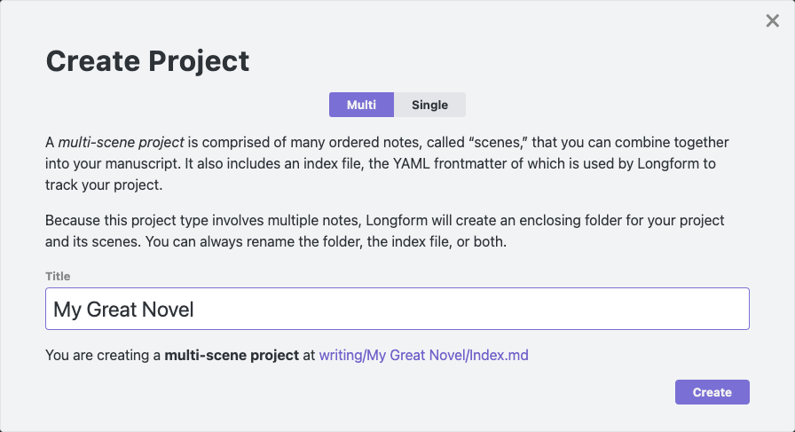
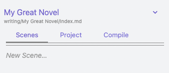
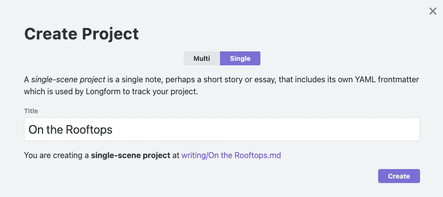

## Longform

Longform is a plugin for [Obsidian](https://obsidian.md) that helps you write and edit novels, screenplays, and other long projects. It lets you organize a series of notes, or _scenes_, into an ordered manuscript. It also supports single-note projects for shorter works. Major features include:

- A dedicated sidebar that collects your projects from across your vault;
- A [reorderable, nestable list](./docs/MULTIPLE_SCENE_PROJECTS.md) of scenes;
- Scene/draft/project [word counts](./docs/WORD_COUNTS.md#word-counts-for-projects-drafts-and-scenes);
- Daily [writing session goals](./docs/WORD_COUNTS.md#writing-sessions-and-word-count-goals) with lots of options to help fit your writing style;
- A [workflow-based compilation tool](./docs/COMPILE.md) that can create manuscripts from your projects;
- Support for [single-scene projects](/docs/SINGLE_SCENE_PROJECTS.md) so that your shorter works can use the same workflows and tooling as your longer ones;
- Plus, many commands, modals, and menu items to help you manage your work.

A Getting Started guide follows; there is also reasonably complete [documentation](./docs/).

## Installing

Longform is in the Community Plugins section of Obsidian’s settings. You may also install it manually by copying the `main.js`, `manifest.json`, and `styles.css` files from a release into a `longform/` folder in your vault's `.obsidian/plugins` folder. The Community Plugins interface is preferred.

## Getting Started

Longform works by searching your vault for any note that contains a frontmatter entry named `longform` (don’t worry if you don’t know what that means; Longform includes tools to help you generate these files). You can think of these notes as your projects' “spines” or tables of contents. Let‘s walk through creating two different Longform projects: a novel and a short story.

### Creating a Novel

1. To begin, find or create a folder in your vault where you’d like to create your novel. Right-click it and select `Create Longform Project`.



2. A `Create Project` modal will appear. This modal lets us choose between Multi- and Single-scene project types. We’re creating a novel, so we’ll stick with Multi. The text under the project type switch explains how each project works.

3. Enter your novel's title in the `Title` field. For this example, we’ll use `My Great Novel`. The modal tells us the type of project we’re creating and the location of the _Index File_ it will create in our vault. We’ll get into what Index Files are in a moment.



> **Note**
>
> You don’t have to use this menu item and modal to create Longform projects. As you will see, Longform projects are one or more notes organized around some YAML frontmatter. You can always create a note yourself somewhere in your vault and use the `Insert Multi-Scene Frontmatter` and `Insert Single-Scene Frontmatter` commands to populate the note—Longform will recognize it automatically. Although not recommended, you can also author the YAML frontmatter manually.

4. Click `Create`. Longform has created the promised file. If we switch to the [Longform pane](./docs/THE_LONGFORM_PANE.md) in the sidebar, we can see the project is already selected. You should see three tabs: Scenes, Project, and Compile, and Scenes should be selected.



5. That _New Scene_ placeholder is a text field—click it and enter something that sounds like the first scene of a novel, maybe “The Sun Rises on Dublin,” and press enter. You should now be editing a so-named note, and your scene should appear in the Scenes tab:


6. Your editor also has the scene open and ready to write. If you click the small `My Great Novel/Index.md` link under your project name, you’ll be taken back to the index file where you’ll see your new scene listed under the `scenes` frontmatter entry:

```yaml
scenes:
  - The Sun Rises on Dublin
```

This is how Longform tracks your work.

> **Warning**
>
> You should probably avoid editing the `longform` frontmatter in your index file unless you know what you’re doing. Longform supports direct editing of it and will do its best to sync, but it’s easy to mess things up accidentally. You can always revert your changes, though: Longform will never delete files based on changes in the index file.

7. You’re now ready to write your novel. Keep adding scenes as needed. If you’d like to add structure to your novel, you can drag scenes left or right (or use the indent/Unindent commands) to create folders of scenes with parent scenes. [The complete documentation for multiple-scene projects](./docs/MULTIPLE_SCENE_PROJECTS.md) might be helpful.

8. When you’re ready to generate a single manuscript for your readers, use the [Compile](./docs/COMPILE.md) feature. Congratulations! You’ve written a novel.

### Creating a Short Story

Longform also supports [single-scene projects](./docs/SINGLE_SCENE_PROJECTS.md) that live as a single note in your vault. Let’s create one.

1. Right-click the enclosing folder and select the `Create Longform Project` menu item.

2. In the Create Project modal, choose `Single`. Let’s write something noirish and call it `On the Rooftops`.



3. Click Create. Because this is a single-scene project, only one note is associated with it, and Longform will open it automatically. The frontmatter at the top tells Longform how to track your project; we’ll write the story in the note itself.

4. Write your story! You can use the Compile tab to generate a manuscript when you're ready. Single-scene projects can use scene and manuscript steps in any order.

## Drafts & Projects

Longform supports the creation of multiple _drafts_ for a given project. Under the hood, drafts are just different Longform projects with the same title—they are then grouped by Longform and presented as different versions of the same project.

To create a new project draft, use the new draft (+) button in the Project tab, or create an entirely new project somewhere and set the title in the Project tab to be the same as your existing project.

You can rename drafts by right-clicking them in the Project tab, selecting Rename, or setting the `draftTitle` attribute in their `longform` frontmatter.

## Compiling

The Compile tab allows you to create custom workflows that turn your project into a manuscript. See [COMPILE.md](https://github.com/kevboh/longform/blob/main/docs/COMPILE.md) for more.

### Scene-only Styling

Longform will automatically attach a `.longform-leaf` class to the container panes of any notes part of a Longform project. This means you can add custom CSS snippets to Obsidian that style your writing environment and _only_ your writing environment. For example, I prefer a dark theme for Obsidian but a light theme for writing, so my writing snippet looks something like this:

```css
/* Set some variables for the entire leaf. */
.longform-leaf {
  --background-primary: white;
  --background-primary-alt: white;
  --background-secondary: white;
  --background-secondary-alt: white;
}

/* Style the editor. */
.longform-leaf .markdown-source-view {
  --background-primary: white;
  --background-primary-alt: white;
  --background-secondary: white;
  --background-secondary-alt: white;
  --text-selection: #aaa;
  --text-normal: black;
  color: black;
  background-color: white;
}

/* Style text selection. */
.longform-leaf .suggestion-item.is-selected {
  background-color: var(--text-accent);
}

/* Style the header of the leaf. */
.longform-leaf .view-header {
  background-color: white;
}

/* Style the text content of the leaf header. */
.longform-leaf .view-header-title {
  --text-normal: black;
}
```

Longform’s UI will always use existing Obsidian CSS theme variables when possible, so it should always look at home in your theme.

## Troubleshooting

First, the most important bit: **Longform is explicitly built never to alter the contents of your notes.** The only note it rewrites is a project’s index file. As such, Longform can’t delete or lose your notes.

Longform does a lot of complex tracking to bridge a project’s metadata with the state of files on disk. Although it tries to cover many edge cases, it is possible to cause a desync between what Longform thinks is happening with projects and what’s happening. This often occurs when a project’s frontmatter is malformed or invalid in some way. Because projects are inferred from frontmatter, if your frontmatter is correct, you can always restart Obsidian (or choose the "reload without saving" command) to force Longform to recalculate projects.

## Sponsorship

Any [sponsorship](https://github.com/sponsors/kevboh) is deeply appreciated, although by no means necessary.

## License

See [LICENSE.md](./LICENSE.md). You can view the license’s history [here](https://git.sr.ht/~boringcactus/fafol/tree/master/LICENSE.md).
