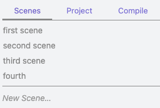
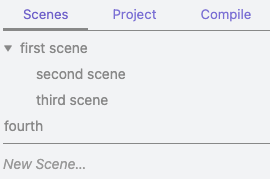
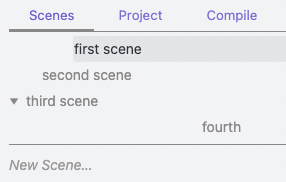

# Multi-scene Projects in Longform

In Longform, a project can either be [single-scene](./SINGLE_SCENE_PROJECTS.md) or multi-scene. Multi-scene projects order a set of notes that live in the same folder. These notes are referred to as _scenes_.

Multi-scene projects have a `Scenes` tab. This tab gives you a lot of features to manage your work as it grows.

## Scene Ordering

Fundamentally, scenes are a manually-ordered set of notes. The Scenes tab allows you to reorder these notes with drag-and-drop. Your list of scenes corresponds to a frontmatter array in your [index file](./INDEX_FILE.md), so:



corresponds to:

```yaml
scenes:
  - first scene
  - second scene
  - third scene
  - fourth
```

Reordering the list in the Scenes tab with drag-and-drop will reorder this frontmatter array (see [The Index File](./INDEX_FILE.md) for more details on how this works).

## Scene Indentation & Nesting

Although the Scenes tab does not correspond directly to a file hierarchy, you can indent and nest scenes as you see fit. For example, here is that same list, but the second and third scenes are now “children” of the first scene:



Clicking the disclosure array next to `first scene` will hide the second and third scenes. As you might expect, indentations are also reflected in your index file’s frontmatter:

```yaml
scenes:
  - first scene
  - - second scene
    - third scene
  - fourth
```

Longform takes advantage of YAML’s syntax for nested arrays to “indent” the frontmatter and make it look like your hierarchy.

There are two ways to change the indentation level of a scene:

1. With the mouse, by dragging left and right on a scene.
2. With the “Indent Scene” and “Unindent Scene” commands. These commands are only available if you are currently editing a scene.

An important note about scene indentation and nesting is that, because your scene list does not directly correspond to a file system, your **indentation does not need to look like a file hierarchy**. For example, this is totally valid in Longform:



Here’s the YAML, if you’re curious:

```yaml
scenes:
  - - - first scene
    - second scene
  - third scene
  - - - - - - - fourth
```

What does this mean? Who knows! It’s your project, organize it how you want.

Of note, Longform includes a documented [API](https://github.com/kevboh/longform/blob/main/src/api/LongformAPI.ts) that can parse and create these YAML lists.

## Unknown Scenes & Ignored Scenes

If Longform detects a `.md` file in your project’s scene folder that it doesn’t know about it will prompt you to add it to your project. This is a change from Longform 1.0 in which new files were automatically added to projects. When a new file is detected you can either:

- **Add** it, in which case it is appended as a scene to your scene list (you can then reorder as needed), or
- **Ignore** it, in which the filename (without the `.md` extension) is added to your project’s `ignoredFiles` list.

Ignored files can exist alongside your scenes without appearing in your scenes list or being compiled. Note that the `ignoredFiles` property supports wildcards. If, for example, you wanted to keep a list of scratch notes” alongside each scene, you could suffix them with `-scratch.md` and then manually add the following to your `ignoredFiles` frontmatter:

```yaml
ignoredFiles:
  - "*-scratch"
```
